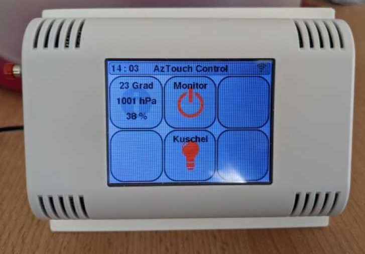

# AzTouchMQTTInterface

This is a project to use the [Az-Touch Wandmod](https://www.az-delivery.de/products/az-touch-wandgehauseset-mit-2-8-zoll-touchscreen-fur-esp8266-und-esp32) as MQTT-Client. It controls later all available MQTT-Clients and send/receive needed commands to view and manipulate each IoT-Device.

## Installation

To use this project, you need [Visual Studio Code](https://code.visualstudio.com/) and [PlatformIO](https://platformio.org/platformio-ide) as extension. Clone or pull the repository to your local machine. After building, PlatformIO tries to transfer the program to ESP32 Node MCU Dev-Board.

## Before start compiling

Before starting to use this project, there needs to be done a modification on the "Az-Touch Wandmod". Otherwise the inbuild SD-Card-slot from TFT-display is not available. For mor information see [Az-delivery]().

## Features

- Simple configuration via XMl-Syntax
- WiFi is configurable via XML-File
- Compiling is possible with all OS (Windows, Mac, Linux)

## Contributing

Pull requests are welcome. For major changes, please open an issue first
to discuss what you would like to change.

Please make sure to update tests as appropriate.

## Roadmap

- [x]  Configuration via XML with own class
- [x]  Debug and Release version
- [X]  Create class for buttons and overview 
- [ ]  Include function to write errors to SD
- [X]  Implement possibility for more than 6 buttons

## License

[GNU AGPLv3](https://choosealicense.com/licenses/agpl-3.0/)
